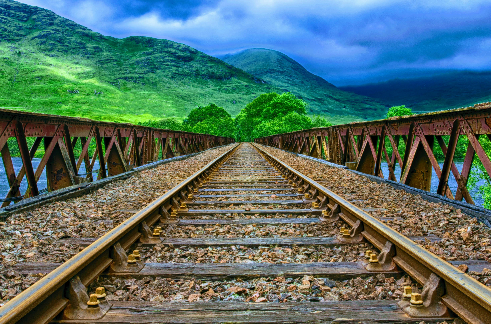

# DeepArt
Developed a web-based deep learning application that performs artistic style transfer using the VGG16 architecture.The system combines content and style images to generate a stylized output, allowing real-time visualization via a browser interface.

Transform your photos into stunning artwork using AI.

# Features

1. Upload a **content image** and a **style image**
2. Perform neural style transfer using a **pre-trained VGG16 model**
3. View the **stylized output in real-time**
4. Displays **100+ intermediate images** during training to monitor progress
5. Responsive UI built with **Bootstrap 5** for seamless use on all devices

# Tech Stack

| Component      | Technologies Used                 |
|----------------|---------------------------------|
| Backend        | Python, Flask                   |
| Deep Learning  | TensorFlow, Keras (VGG16), NumPy |
| Frontend       | HTML5, Bootstrap 5             |
| Visualization  | Matplotlib (for intermediate image generation) |

<h2>Project Structure</h2>
<pre>
Image_Style_Transfer/
├── static/
│   ├── uploads/           <small># Uploaded content &amp; style images</small>
│   └── stylized_result.jpg  <small># Final output image</small>
├── templates/
│   └── index.html          <small># Frontend HTML template</small>
├── app.py                  <small># Flask application</small>
├── style_transfer.py       <small># Core VGG16-based style transfer logic</small>
└── README.md               <small># Project documentation</small>
</pre>

# Sample Output

## Content Image

## Style Image

## Stylized Result

